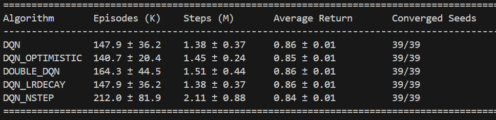

# The ICU-Sepsis Environment (Baseline Algorithms Implementation)

The **ICU-Sepsis** environment is a reinforcement learning environment that
simulates the treatment of sepsis in an intensive care unit (ICU). The
environment is introduced in the paper
[ICU-Sepsis: A Benchmark MDP Built from Real Medical Data](https://arxiv.org/abs/2406.05646),
accepted at the Reinforcement Learning Conference, 2024. ICU-Sepsis is built
using the [MIMIC-III Dataset](https://physionet.org/content/mimiciii/1.4/),
based on the work of
[Komorowski et al. (2018)](https://www.nature.com/articles/s41591-018-0213-5). The environment can be found at the following [Repository](https://github.com/icu-sepsis/icu-sepsis/tree/main).


Citation:
```bibtex
@inproceedings{
  choudhary2024icusepsis,
  title={{ICU-Sepsis}: A Benchmark {MDP} Built from Real Medical Data},
  author={Kartik Choudhary and Dhawal Gupta and Philip S. Thomas},
  booktitle={Reinforcement Learning Conference},
  year={2024},
  url={https://arxiv.org/abs/2406.05646}
}
```

## Prerequisites

### Python Environment Setup

This project requires **Python 3.11** (Python 3.12 is not compatible due to package dependencies).

Create and activate a conda environment:

```bash
conda create -n deep_reinforcement_learning python=3.11
conda activate deep_reinforcement_learning
```

### Install Dependencies

Install required Python packages:

```bash
pip install -r requirements.txt
```

**Note**: The requirements include:
- `numpy==1.25.2` (requires Python ≤3.11)
- `torch==2.0.1`
- `gymnasium==0.28.1`
- `icu-sepsis==2.0.1`
- Other RL and logging packages

### Install GNU Parallel

GNU parallel is required to run multiple experiment configurations in parallel.

**On macOS:**

```bash
# Accept Xcode license (if needed)
sudo xcodebuild -license accept

# Install via Homebrew
brew install parallel
```

**On Linux:**

```bash
# Ubuntu/Debian
sudo apt-get install parallel

# CentOS/RHEL
sudo yum install parallel
```

To silence the citation notice, run once:

```bash
parallel --citation
```

## Code Organization

The code is organized as follows:

`experiments`: Contains the JSON files containing the hyperparameters and configurations for the different methods. 

`src`: Contains the source code for different algorithms. 

`run`: Contains the scripts to run the experiments.

### Running the code using json file. 

Experiments are configured using JSON files that specify algorithm hyperparameters. For example, `experiments/debug.json` contains settings like:
- `algo`: Algorithm name (e.g., "dqn", "dqn_optimistic", "ppo", "sac")
- `seed`: List of random seeds for multiple runs (e.g., `[0,1,2,3,4]`)
- `learning_rate`: Learning rate values to test (can be single value or list)
- `buffer_size`: Replay buffer size for off-policy algorithms
- `batch_size`: Mini-batch size for training
- `max_episodes`: Number of training episodes

Parameters specified as lists will generate multiple experiment configurations (Cartesian product). Each combination of parameters with each seed creates a unique experiment.

**Switching between algorithms:** To test a modified algorithm (e.g., DQN with optimistic initialization), simply change the `"algo"` field in `debug.json`:
```json
"algo": "dqn_optimistic"
```

To run a specific experiment configuration:

```bash
python src/mainjson.py experiments/debug.json 0
```
The above command will run the first configuration in the `debug.json` file (configuration index 0).


### Executing a sweep
Using GNU parallel we can run multiple configurations in parallel. 

```bash
python run/local.py -p src/mainjson.py -j experiments/debug.json
``` 
The above command will try to run all possible configurations in parallel. One can limit the number of threads based on their system using `-c` flag. 

The results for the experiments are stored in `results` folder. Each file in the results folder stores a single hyperparameter configuration with a single seed value. 

#### Process results
We then need to aggregate the results across different seeds using the following command. 

```bash
python analysis/process_data.py experiments/debug.json
```

#### Plot the results
Finally, we can plot the results using the following command. 

```bash
python analysis/learning_curve.py y returns auc experiments/debug.json
```
The above plots the returns using area under the curve (AUC) as a metric to select the best parameters, for the configurations in the `debug.json` file.

The plot is created in the `plots` folder.

#### Calculate convergence metrics
To calculate performance metrics similar to Table 3 in the paper (episodes to convergence, steps to convergence, and average return).

**For testing and development** (quick validation with debug configurations):

```bash
python analysis/convergence_metrics.py experiments/debug.json
```

**For final comparison** (after completing large-scale runs with production settings):

```bash
python analysis/convergence_metrics.py experiments/PaperPlots/dqn.json experiments/PaperPlots/ppo.json experiments/PaperPlots/sac.json
```

The output table contains:
- **Episodes (K)**: Number of episodes needed to converge (in thousands)
- **Steps (M)**: Total environment steps to convergence (in millions)
- **Average Return**: Mean return over the last 1000 time steps
- **Converged Seeds**: Fraction of random seeds that reached convergence threshold (0.85)

## Large-Scale DQN Variants Comparison Study

### Study Description

This comprehensive study compares **5 DQN variants** to evaluate the effectiveness of different algorithmic improvements on the ICU-Sepsis environment:

1. **Standard DQN** (Baseline) - Classic Deep Q-Network implementation
2. **DQN with Optimistic Q-Initialization** - Uses Xavier uniform weight initialization and positive bias (bias_const=1.0) to encourage early exploration
3. **Double DQN** - Decouples action selection from action evaluation to reduce overestimation bias
4. **DQN with Learning Rate Decay** - Implements linear learning rate decay from initial LR to near-zero over training
5. **N-Step DQN** - Uses 3-step returns for better credit assignment

All algorithms use **identical hyperparameters** for fair comparison:
- **39 random seeds** per algorithm (195 total runs)
- **500,000 episodes** per run
- **Replay buffer**: 10,000 transitions
- **Batch size**: 64
- **Learning rate**: 0.001 (initial)
- **Exploration**: ε-greedy from 1.0 → 0.001 over 25% of episodes
- **Target network update**: Every 512 steps

**Estimated runtime**: 13 hours on a 16-core system (15 cores utilized, 1 reserved for system)

### Running the Comparison Study

**Option 1: Sequential Execution (Recommended)**

Runs one algorithm at a time using all 15 cores for maximum throughput per algorithm:

```powershell
.\run\run_comparison_sequential.ps1
```

This will:
- Execute each algorithm sequentially
- Utilize all 15 cores per algorithm
- Complete in approximately 13 hours
- Provide progress updates after each algorithm finishes

**Option 2: Parallel Execution**

Runs all 5 algorithms simultaneously with 3 cores each:

```powershell
.\run\run_comparison_study.ps1 -CoresPerExperiment 3
```

This will:
- Launch 5 separate PowerShell windows
- Run all algorithms in parallel
- Complete in approximately 13 hours
- Higher system load but easier to monitor individual algorithms

### Monitoring Progress

**Check total completed runs:**
```powershell
ls results/*/*.dw | Measure-Object | Select-Object -ExpandProperty Count
```

Expected final count: **195 files** (39 seeds × 5 algorithms)

**Check progress by algorithm:**
```powershell
ls results/dqn/*.dw | Measure-Object
ls results/dqn_optimistic/*.dw | Measure-Object
ls results/double_dqn/*.dw | Measure-Object
ls results/dqn_lrdecay/*.dw | Measure-Object
ls results/dqn_nstep/*.dw | Measure-Object
```

### Analyzing Results

After all experiments complete:

**1. Aggregate results across seeds:**
```powershell
python analysis/process_data.py experiments/comparison_dqn.json
python analysis/process_data.py experiments/comparison_dqn_optimistic.json
python analysis/process_data.py experiments/comparison_double_dqn.json
python analysis/process_data.py experiments/comparison_dqn_lrdecay.json
python analysis/process_data.py experiments/comparison_dqn_nstep.json
```

**2. Generate learning curve comparison:**
```powershell
python analysis/learning_curve.py y returns auc experiments/comparison_dqn.json experiments/comparison_dqn_optimistic.json experiments/comparison_double_dqn.json experiments/comparison_dqn_lrdecay.json experiments/comparison_dqn_nstep.json
```

**3. Calculate convergence metrics:**
```powershell
python analysis/convergence_metrics.py experiments/comparison_dqn.json experiments/comparison_dqn_optimistic.json experiments/comparison_double_dqn.json experiments/comparison_dqn_lrdecay.json experiments/comparison_dqn_nstep.json
```

### Expected Outputs

The analysis will generate:
- **Learning curves** with confidence intervals comparing all 5 algorithms
- **Convergence metrics table** showing episodes/steps to convergence and average returns
- **Statistical comparison** across 39 seeds per algorithm for robust conclusions

Results will be saved in:
- `plots/` - Learning curve visualizations
- `processed/` - Aggregated data files (.pcsd format)

